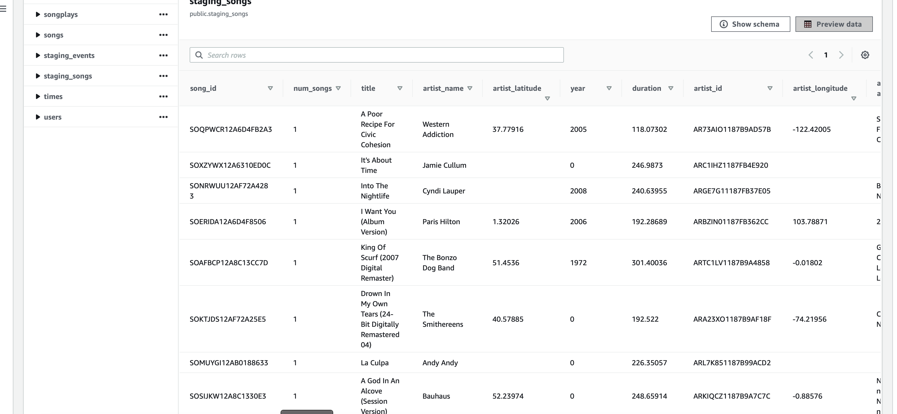

## Background
This project extracts data from a sample songplay dataset on a S3 bucket, transforms it to fact and dimension tables in Redshift.

## Setting up Redshift

Follow instructions in `L3 Exercise 2 - IaC - Solution.ipynb` to set up a Redshift Cluster.

## Dataset

Data in `http://udacity-dend.s3.us-west-2.amazonaws.com`

## Running the scripts
Store the `HOST` and `ARN` from the Redshift setup in `dwh.cfg`

Run `create_tables.main()`

Run `etl.main()`

## Debugging

Use 'Select * From stl_load_errors' to debug errors

Use a subset of Song data for faster loading and debugging i.e. set SONG_DATA='s3://udacity-dend/song-data/A/A'

## Expected results

Populated staging tables:

Staging Events

Staging Songs

Populated tables:

Artists

Songs

Users

Songplays

Times
